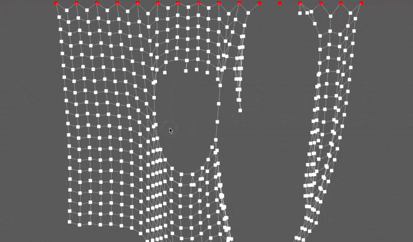

# bevy_verlet

Simple Verlet points and sticks implementation for bevy.

## Features

You can simply add a `VerletPoint` component on any entity with a `Transform` and the verlet physics will apply.

Connect points using `VerletStick` to constrain movement (see [examples](./examples)).

Lock some points by adding the `VerletLocked` component on a `VerletPoint` entity.

Customize *friction* and *gravity* with the `VerletConfig` resource.

> Works in 2D and 3D.

## Cargo features

1. `debug`

    This feature will add a *system* drawing debug lines for every stick using [bevy_prototype_debug_lines](https://crates.io/crates/bevy_prototype_debug_lines)

2. `shuffle`

    This feature will randomize the `VerletStick` computation, can be costly and make the processing jittery.

## Examples

### 2D

1. 2D Line

   `cargo run --example 2d_line --features "debug"`

   

3. 2D cloth

   `cargo run --example 2d_cloth --features "debug"`

   

4. 2D cloth cutting

   `cargo run --example 2d_cloth_cutter --features "debug"`

   *Cutting cloth without max tension*
   

   *Sticks breaking on max tension*
   

### 3D

* `cargo run --example 3d_line --features "debug"`
* `cargo run --example 3d_cloth --features "debug"`

## Credits

Inspired by:
- This [Sebastian Lague video](https://www.youtube.com/watch?v=PGk0rnyTa1U)
- This [Coding Math course](https://www.youtube.com/watch?v=3HjO_RGIjCU)
