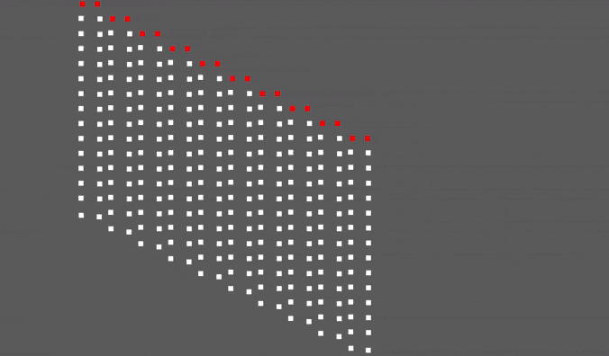

<!-- cargo-sync-readme start -->

# Verlet Integration for Bevy

Simple Verlet points and sticks implementation for bevy.

If you are looking for cloth physics, please check [`bevy_silk`](https://github.com/ManevilleF/bevy_silk) instead,

## Bevy versions

 | `bevy_verlet` | `bevy`    |
 |---------------|-----------|
 | 0.1.x         | 0.5.x     |
 | 0.2.x         | 0.6.x     |
 | 0.3.x         | 0.7.x     |
 | 0.4.x         | 0.8.x     |
 | 0.5.x         | 0.9.x     |

## Features

You can simply add a `VerletPoint` component on any entity with a `Transform` and the verlet physics will apply.

Connect points using `VerletStick` to constrain movement (see [examples](./examples)).

Lock some points by adding the `VerletLocked` component on a `VerletPoint` entity.

Customize *friction* and *gravity* with the `VerletConfig` resource.

> Works in 2D and 3D.

## Cargo features

1. `debug`

This feature will add a *system* drawing debug lines for every stick using [`bevy_prototype_debug_lines`](https://crates.io/crates/bevy_prototype_debug_lines)

<!-- cargo-sync-readme end -->

## Examples

### 2D

1. 2D Line

   `cargo run --example 2d_line --features "debug"`

   

2. 2D cloth

   `cargo run --example 2d_cloth --features "debug"`

   

3. 2D cloth cutting

   `cargo run --example 2d_cloth_cutter --features "debug"
   
   

### 3D

* `cargo run --example 3d_line --features "debug"`
* `cargo run --example 3d_cloth --features "debug"`

## Credits

Inspired by:
- This [Sebastian Lague video](https://www.youtube.com/watch?v=PGk0rnyTa1U)
- This [Coding Math course](https://www.youtube.com/watch?v=3HjO_RGIjCU)
