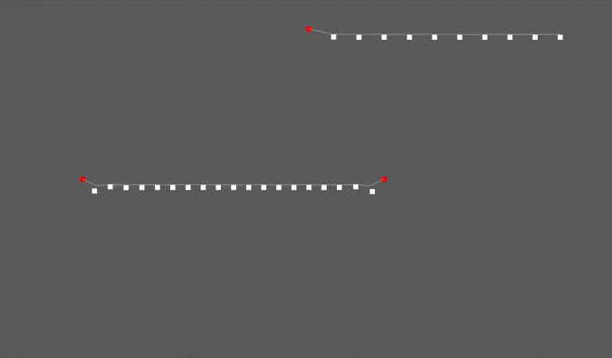

# bevy_verlet

Simple Verlet points and sticks implementation for bevy.

## Features

You can simply add a `VerletPoint` component on any entity with a `Transform` and the verlet physics will apply.

Connect points using `VerletStick` to constrain movement (see [examples](./examples)).

Lock some points by adding the `VerletLocked` component on a `VerletPoint` entity.

Customize *friction* and *gravity* with the `VerletConfig` resource.

> Works in 2D and 3D.

## Examples

### 2D

* `cargo run --example 2d_line --features "debug"`
* `cargo run --example 2d_cloth --features "debug"`

### 3D

* `cargo run --example 3d_line --features "debug"`
* `cargo run --example 3d_cloth --features "debug"`

## Credits

Inspired by:
- This [Sebastian Lague video](https://www.youtube.com/watch?v=PGk0rnyTa1U)
- This [Coding Math course](https://www.youtube.com/watch?v=3HjO_RGIjCU)
